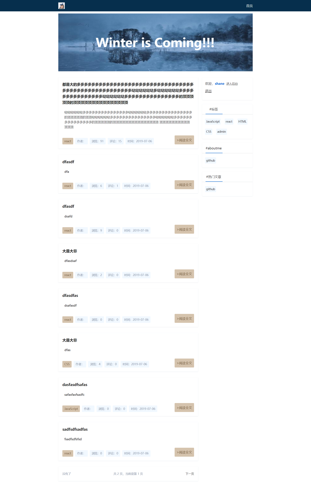
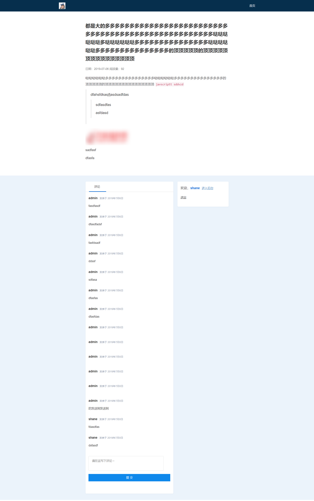
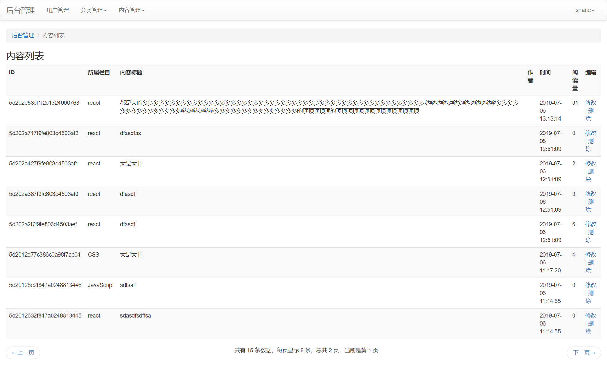

## 描述

基于node.js的博客，没有采用前后端分离，采用后端渲染的方式

主要目的：

- 了解node.js
- 熟悉后端开发的流程
- 更好的SEO

未开发的接口可以继续扩展


## 主要技术

- 服务端：Node.js `>=7.9.0 `
- 数据库：MongoDB `>=3.4`
- 数据库操作工具：mongoose`4.9`
- WEB框架：Express `4.0`
- 模板引擎：swig'`>=3.0`


## 页面功能

前台：

- 首页展示
- 登陆
- 注册
- 文章详情
- 评论
- 分页
- markdown支持

后台：

- 用户管理
- 标签分类（增删改查）
- 文章（增删改查）
- 日志
- xss
- csurf


## Build Setup

```
# install dependencies
npm install 或者 yarn

# serve at localhost: 8080
node index

```


## 页面效果

首页


文章


后台



